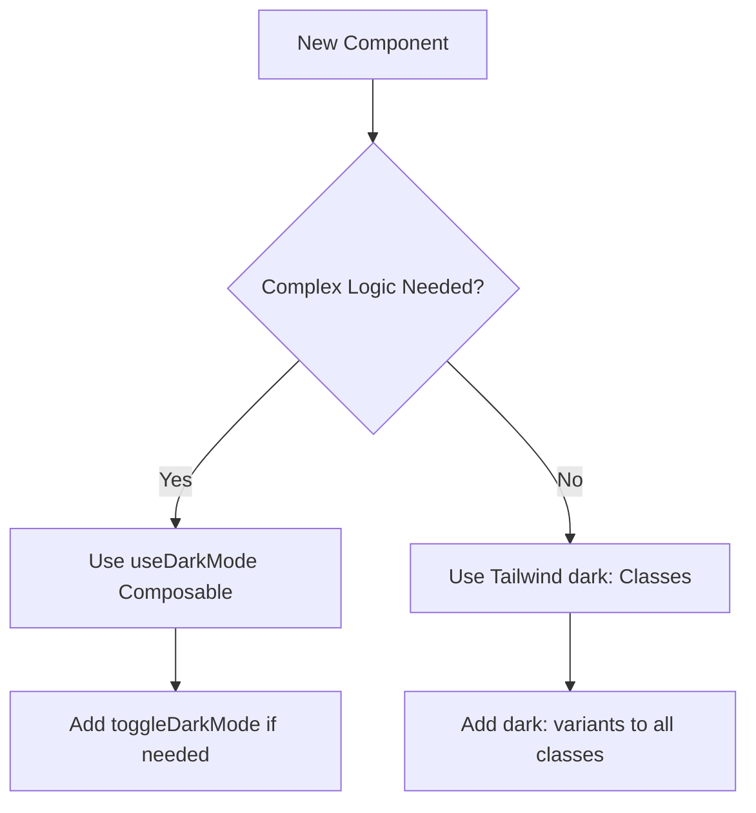

# Dark Mode Implementation Standards

## 🎯 Mandatory Implementation Rules

### 1. Always Implement Dark Mode
Every new component MUST include dark mode support. No exceptions.

### 2. Use the Established Pattern
Follow the decision tree for implementation approach.

### 3. Color Consistency
Use only the approved color palette from this document.

## 🏗️ Implementation Decision Tree



## 📋 Implementation Checklist

### For Every Component:
- [ ] Background colors have dark variants
- [ ] Text colors have dark variants  
- [ ] Border colors have dark variants
- [ ] Interactive states have dark variants
- [ ] Hover states have dark variants
- [ ] Focus states have dark variants
- [ ] Tested in both modes

### For Complex Components:
- [ ] Import useDarkMode composable
- [ ] Create computed property: `const isDarkMode = computed(() => isDark.value)`
- [ ] Use computed property in template
- [ ] Add toggle functionality if needed

### For Simple Components:
- [ ] Use Tailwind `dark:` classes
- [ ] No JavaScript logic for theme switching
- [ ] CSS-only implementation

## 🎨 Color Palette (MANDATORY)

### Background Colors
```css
/* Light Mode */
bg-white → dark:bg-gray-800
bg-gray-50 → dark:bg-gray-700
bg-gray-100 → dark:bg-gray-900
bg-gray-200 → dark:bg-gray-800

/* Dark Mode Only */
dark:bg-gray-900
dark:bg-gray-800
dark:bg-gray-700
```

### Text Colors
```css
/* Light Mode */
text-gray-900 → dark:text-white
text-gray-800 → dark:text-gray-100
text-gray-700 → dark:text-gray-200
text-gray-600 → dark:text-gray-300
text-gray-500 → dark:text-gray-400
text-gray-400 → dark:text-gray-500

/* Dark Mode Only */
dark:text-white
dark:text-gray-100
dark:text-gray-200
dark:text-gray-300
dark:text-gray-400
dark:text-gray-500
```

### Border Colors
```css
/* Light Mode */
border-gray-200 → dark:border-gray-700
border-gray-300 → dark:border-gray-600
border-gray-100 → dark:border-gray-800

/* Dark Mode Only */
dark:border-gray-700
dark:border-gray-600
dark:border-gray-800
```

### Interactive Colors
```css
/* Blue - Primary Actions */
text-blue-600 → dark:text-blue-400
bg-blue-600 → dark:bg-blue-500
hover:bg-blue-700 → dark:hover:bg-blue-600
focus:ring-blue-500 → dark:focus:ring-blue-400
focus:border-blue-500 → dark:focus:border-blue-400

/* Green - Success */
text-green-600 → dark:text-green-400
bg-green-600 → dark:bg-green-500
hover:bg-green-700 → dark:hover:bg-green-600

/* Red - Error/Danger */
text-red-600 → dark:text-red-400
bg-red-600 → dark:bg-red-500
hover:bg-red-700 → dark:hover:bg-red-600

/* Yellow - Warning */
text-yellow-600 → dark:text-yellow-400
bg-yellow-600 → dark:bg-yellow-500
hover:bg-yellow-700 → dark:hover:bg-yellow-600
```

## 📝 Template Patterns

### Basic Container
```html
<div class="bg-white dark:bg-gray-800 rounded-xl shadow-lg border border-gray-200 dark:border-gray-700 p-6">
    <!-- Content -->
</div>
```

### Card Component
```html
<div class="bg-white dark:bg-gray-800 rounded-xl shadow-lg border border-gray-200 dark:border-gray-700 p-6">
    <h3 class="text-lg font-semibold text-gray-900 dark:text-white mb-4">
        Card Title
    </h3>
    <p class="text-gray-600 dark:text-gray-300 mb-4">
        Card description
    </p>
    <div class="flex justify-between items-center">
        <span class="text-sm text-gray-500 dark:text-gray-400">Status</span>
        <button class="px-3 py-1 bg-blue-600 dark:bg-blue-500 text-white rounded-lg hover:bg-blue-700 dark:hover:bg-blue-600 transition-colors duration-200">
            Action
        </button>
    </div>
</div>
```

### Form Elements
```html
<!-- Input Field -->
<input 
    type="text"
    class="w-full px-4 py-2 border border-gray-300 dark:border-gray-600 
           bg-white dark:bg-gray-700 text-gray-900 dark:text-white 
           rounded-lg focus:ring-2 focus:ring-blue-500 focus:border-blue-500 
           placeholder:text-gray-500 dark:placeholder-gray-400"
/>

<!-- Textarea -->
<textarea 
    class="w-full px-4 py-2 border border-gray-300 dark:border-gray-600 
              bg-white dark:bg-gray-700 text-gray-900 dark:text-white 
              rounded-lg resize-none focus:ring-2 focus:ring-blue-500 focus:border-blue-500"
></textarea>

<!-- Select -->
<select 
    class="w-full px-4 py-2 border border-gray-300 dark:border-gray-600 
            bg-white dark:bg-gray-700 text-gray-900 dark:text-white 
            rounded-lg focus:ring-2 focus:ring-blue-500 focus:border-blue-500"
>
    <option>Option 1</option>
</select>
```

### Buttons
```html
<!-- Primary Button -->
<button class="px-4 py-2 bg-blue-600 dark:bg-blue-500 text-white rounded-lg 
            hover:bg-blue-700 dark:hover:bg-blue-600 transition-colors duration-200">
    Primary Action
</button>

<!-- Secondary Button -->
<button class="px-4 py-2 bg-gray-200 dark:bg-gray-700 text-gray-700 dark:text-gray-300 
            rounded-lg hover:bg-gray-300 dark:hover:bg-gray-600 transition-colors duration-200">
    Secondary Action
</button>

<!-- Outline Button -->
<button class="px-4 py-2 border border-gray-300 dark:border-gray-600 text-gray-700 dark:text-gray-300 
            rounded-lg hover:bg-gray-50 dark:hover:bg-gray-800 transition-colors duration-200">
    Outline Action
</button>
```

### Navigation
```html
<!-- Tab Navigation -->
<nav class="flex space-x-8 border-b border-gray-200 dark:border-gray-700">
    <button 
        class="py-4 px-1 border-b-2 font-medium text-sm transition-colors
               border-blue-500 text-blue-600 
               dark:border-blue-400 dark:text-blue-400"
    >
        Active Tab
    </button>
    <button 
        class="py-4 px-1 border-b-2 font-medium text-sm transition-colors
               border-transparent text-gray-500 hover:text-gray-700 hover:border-gray-300
               dark:text-gray-400 dark:hover:text-gray-200 dark:hover:border-gray-600"
    >
        Inactive Tab
    </button>
</nav>
```

### Status Indicators
```html
<!-- Success -->
<div class="inline-flex items-center px-2 py-1 rounded-full text-xs font-medium 
         bg-green-100 dark:bg-green-900 text-green-800 dark:text-green-200">
    Success
</div>

<!-- Warning -->
<div class="inline-flex items-center px-2 py-1 rounded-full text-xs font-medium 
         bg-yellow-100 dark:bg-yellow-900 text-yellow-800 dark:text-yellow-200">
    Warning
</div>

<!-- Error -->
<div class="inline-flex items-center px-2 py-1 rounded-full text-xs font-medium 
         bg-red-100 dark:bg-red-900 text-red-800 dark:text-red-200">
    Error
</div>

<!-- Info -->
<div class="inline-flex items-center px-2 py-1 rounded-full text-xs font-medium 
         bg-blue-100 dark:bg-blue-900 text-blue-800 dark:text-blue-200">
    Info
</div>
```

## 🔧 Script Patterns

### Composable Usage (Complex Components)
```javascript
import { computed } from 'vue';
import { useDarkMode } from '@/composables/useDarkMode';

export default {
    setup() {
        const { isDark, toggleDarkMode } = useDarkMode();
        const isDarkMode = computed(() => isDark.value);
        
        // Use isDarkMode in template
        return { isDarkMode, toggleDarkMode };
    }
};
```

### Tailwind Only (Simple Components)
```javascript
export default {
    setup() {
        // No dark mode logic needed
        // Just use dark: classes in template
        return {};
    }
};
```

### Mixed Approach
```javascript
export default {
    setup() {
        const { isDark, toggleDarkMode } = useDarkMode();
        const isDarkMode = computed(() => isDark.value);
        
        // Use isDarkMode for complex logic
        // Use dark: classes for simple UI
        return { isDarkMode, toggleDarkMode };
    }
};
```

## ✅ Quality Assurance

### Automated Testing
```javascript
// Test both modes
describe('DarkMode', () => {
    it('should toggle dark mode', async () => {
        const wrapper = mount(Component);
        
        // Test light mode
        expect(wrapper.find('.bg-white').exists()).toBe(true);
        
        // Toggle to dark mode
        await wrapper.setData({ isDark: true });
        expect(wrapper.find('.bg-gray-800').exists()).toBe(true);
        
        // Toggle back to light mode
        await wrapper.setData({ isDark: false });
        expect(wrapper.find('.bg-white').exists()).toBe(true);
    });
});
```

### Manual Testing Checklist
- [ ] Toggle button works in both modes
- [ ] All colors change correctly
- [ ] No color bleeding (light colors in dark mode)
- [ ] Hover states work in both modes
- [ ] Focus states work in both modes
- [ ] Text remains readable in both modes
- [ ] Icons/imagery adapt if needed

## 🚨 Common Mistakes to Avoid

### ❌ Don't Mix Patterns
```javascript
// WRONG: Don't mix useDarkMode with manual DOM manipulation
const { isDark } = useDarkMode();
if (isDark.value) {
    document.body.classList.add('dark'); // Don't do this
}
```

### ❌ Don't Use Magic Numbers
```html
<!-- WRONG: Hardcoded colors -->
<div class="bg-gray-100 dark:bg-gray-800"> <!-- Don't use gray-100 -->

<!-- RIGHT: Use semantic colors -->
<div class="bg-gray-50 dark:bg-gray-800">
```

### ❌ Don't Forget Interactive States
```html
<!-- WRONG: Missing dark mode hover -->
<button class="bg-blue-600 text-white rounded-lg hover:bg-blue-700">
    Button
</button>

<!-- RIGHT: Include dark mode hover -->
<button class="bg-blue-600 dark:bg-blue-500 text-white rounded-lg 
        hover:bg-blue-700 dark:hover:bg-blue-600 transition-colors duration-200">
    Button
</button>
```

## 📚 Reference Components

Study these components for proper implementation:
- `BusinessStats.vue` - Complex composable usage
- `RecentOrders.vue` - Tailwind-only approach
- `BusinessTabNavigation.vue` - Mixed approach
- `ProductsTab.vue` - Simple Tailwind classes

---

## 🎯 Enforcement Rules

1. **Code Review**: Every PR must include dark mode review
2. **Automated Testing**: CI must test both light and dark modes
3. **Documentation**: Complex components need JSDoc comments
4. **Manual Testing**: Test manually in browser before PR

**No exceptions to these rules.** Dark mode support is mandatory for all components.
